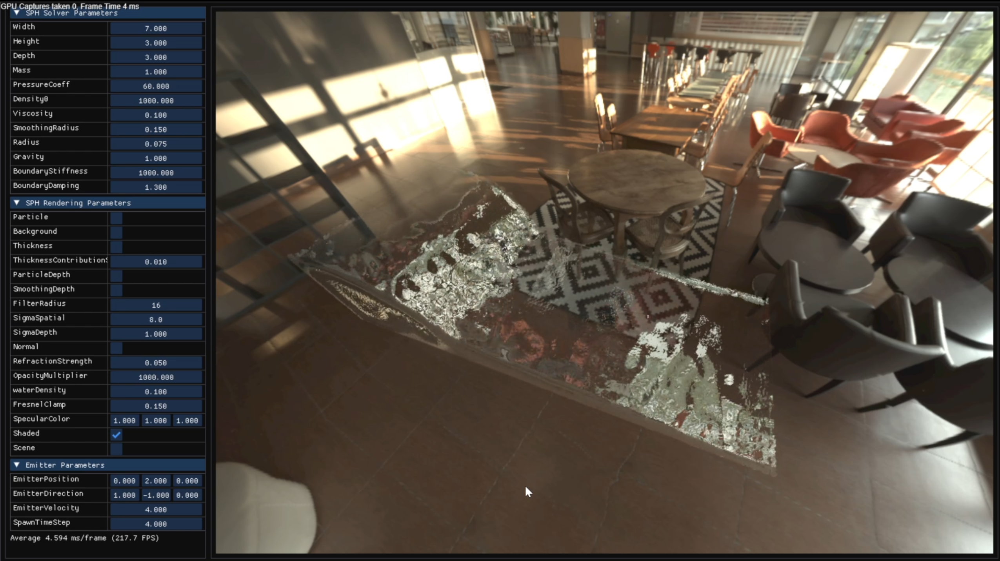

# DX12 WCSPH (EOS-SPH) Attempt — Archived

A repository exploring WCSPH (EOS-SPH) fluid simulation based on **DirectX 12 Compute Shaders**.  
This project is currently **Archived**. The plan is to maintain the existing DX12 compute pipeline while **re-implementing the physics solver using PBF/XPBD approaches**.

[](https://www.youtube.com/watch?v=p0LWeu2Y7aQ)

> Detailed Postmortem & Decisions: [POSTMORTEM.md](./Docs/POSTMORTEM.md)

---

## What’s inside (Implemented / WIP)
- **DX12 Particle Pipeline:** Compute shader-based spawn/update loop integrated with the graphics rendering pipeline.
- **2D Boundary Collision:** Basic boundary handling with debug visualization.
- **Neighbor Search (Uniform Grid):** Spatial Hashing implementation.
  - Hashing → Grouping → Scan/Prefix-sum (**WIP**)
- **Physics Solver:** Preliminary implementation of Density/Pressure (EOS) calculation and Force application steps.

---

## Requirements
- Windows 10+ (DirectX 12)
- Visual Studio 2019 or later
- C++17 Standard
- vcpkg
- Windows SDK 10.0.18362.0+ (HLSL 2021)

---

## Build & Run (Quick Start)

### 1) Install vcpkg
```sh
git clone [https://github.com/microsoft/vcpkg.git](https://github.com/microsoft/vcpkg.git)
cd vcpkg
bootstrap-vcpkg.bat
vcpkg integrate install

```

### 2) Enable vcpkg manifest mode (Visual Studio)

Go to: **Project Properties** -> **vcpkg** -> **Use Vcpkg Manifest** = **Yes**

Dependencies will be automatically installed based on `vcpkg.json`.

### 3) Build & Run

Open Solution -> Select **x64** / **Debug** (or Release) -> Run

---

## Assets / Third-Party Content

This repository uses an HDRI environment map originally from ambientCG:

* **Asset:** IndoorEnvironmentHDRI013 (converted to cubemap)
* **Source:** [ambientCG.com](https://ambientcg.com/a/IndoorEnvironmentHDRI013)
* **License:** Creative Commons CC0 1.0 Universal

> Created using IndoorEnvironmentHDRI013 from ambientCG.com, licensed under CC0 1.0 Universal.

---

## Debug Shader PDB

* In **Debug** builds, shader PDB files are generated under `./PDB/`.
* It is recommended to configure the `./PDB/` folder to be generated at runtime (excluded from version control).

---

## Repository Notes

* **Key Fluid Simulation Code:**
* `Core/SphSimulator.cpp`
* `Shaders/SphCS.hlsl`

---

## Controls

* `Space` : Start / Pause simulation
* `F` : Toggle camera lock
* `T` : Toggle particle init mode (Dam Break / Emitter)
* `R` : Reset particle positions
* `W/A/S/D` : Move camera

---

## License

* **Code:** MIT License (see [LICENSE](https://www.google.com/search?q=./LICENSE))
* **Third-party assets:** Subject to their respective licenses (e.g., ambientCG HDRI is CC0 1.0).

---

## Technical Notes (High-level)

* **GPU Neighbor Search:** Implemented using Spatial Hashing + Grouping + Prefix-sum (Cell ranges).
* **Sorting:** Bitonic sort (Initially naive implementation → Attempted optimization → Reverted for stability).
* **Data Layout:** Tested both AoS and SoA; **SoA (Structure of Arrays)** demonstrated better performance in this compute pipeline.
* **Debugging:** Validated using PIX (GPU buffer inspection) and UAV barriers between compute passes.
* **Scale:** Tested up to ~100k particles (50×40×50 grid), with a compute group size of 512.
